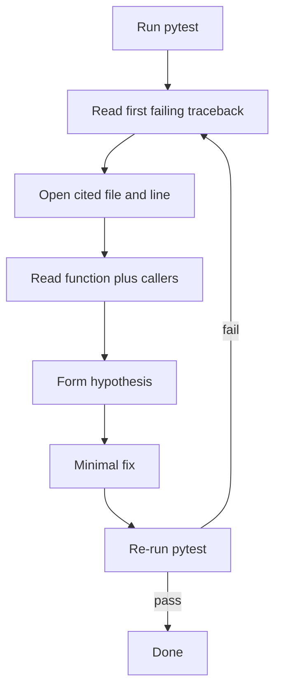

# Bug Squash Practice (Stripe-style)

Three standalone exercises modeled on Stripe's functional debugging round. Each is a small, idiomatic Python library with a failing test suite. Your job is to find and fix the bug(s), then re-run tests until everything passes.

## Setup

From any exercise directory:

```bash
python -m venv .venv
```

Windows:

```batch
.\.venv\Scripts\activate
pip install -r ..\requirements.txt
```

macOS / Linux:

```bash
source .venv/bin/activate
pip install -r ../requirements.txt
```

## Exercises

| Directory | Theme |
|-----------|-------|
| [01_path_collector](01_path_collector/) | File path expansion / ingestion |
| [02_config_linter](02_config_linter/) | AST-based config validation |
| [03_metrics_store](03_metrics_store/) | Concurrent metrics aggregation |

Work through them in order or pick one at random. Each exercise is fully independent.

## Interview workflow

1. Run `python -m pytest -v` and read the first failure.
2. Follow the traceback to the cited file and line.
3. Read the failing function and its callers — don't grep randomly.
4. Form a hypothesis, apply a minimal fix, re-run tests.
5. Repeat until green.

Useful pytest flags:

```bash
python -m pytest -v -x                    # stop at first failure
python -m pytest tests/test_collector.py  # one file
python -m pytest -k test_single_file      # one test by name
```

## Debugging strategy

Stripe's tip: focus on **strategy**, not aimless searching.



**Start from the test.** The test name and assertion tell you what behavior is expected. The traceback tells you where the code actually went wrong.

**Read before you edit.** Skim the module that failed, then the module that called it. Understand the data shape (paths, AST nodes, thread counts) before changing anything.

**Fix minimally.** One logical bug usually causes multiple test failures. After a fix, run the full suite — a correct fix should not break passing tests.

**Use your tools.** Print debugging, `pytest --pdb` to drop into the debugger on failure, or IDE breakpoints are all fine. Have your environment set up before interview day.

## What each exercise practices

- **01_path_collector** — filesystem edge cases; missing validation before I/O.
- **02_config_linter** — traversing an AST with a visitor; unhandled node types.
- **03_metrics_store** — concurrency; lost updates from unguarded read-modify-write.
